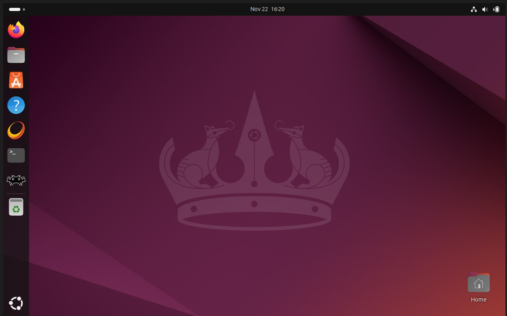
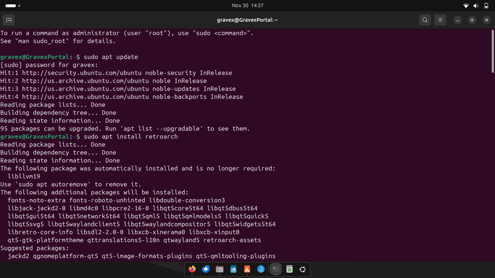
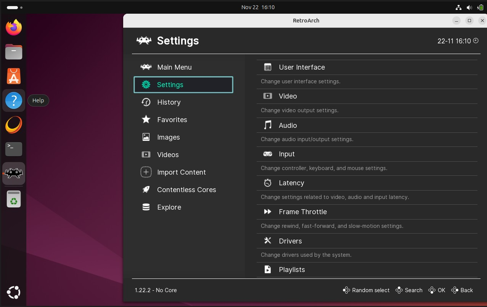
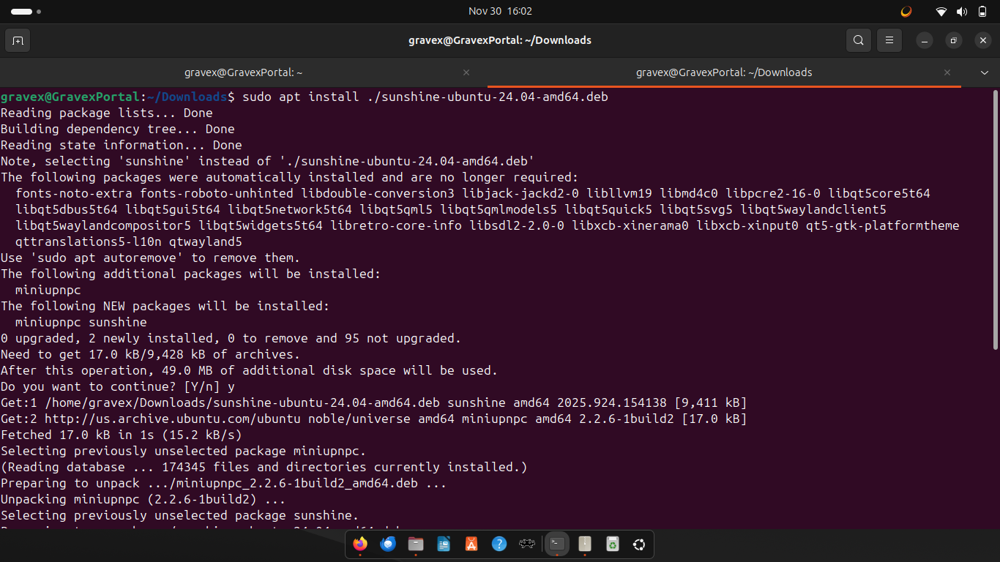
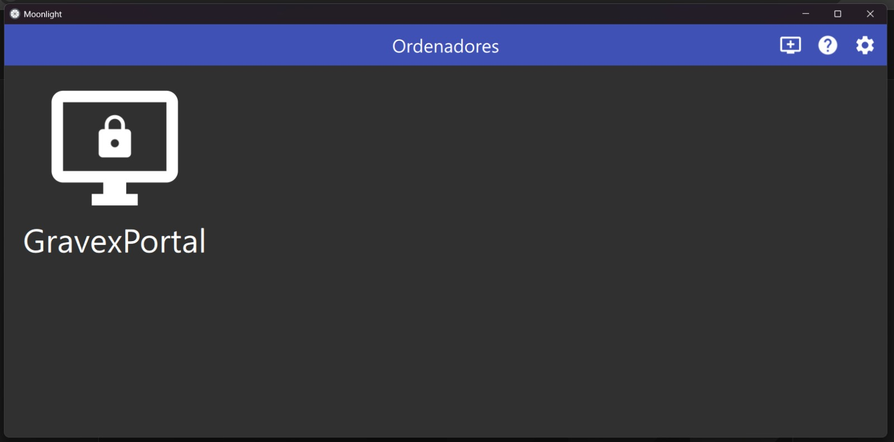
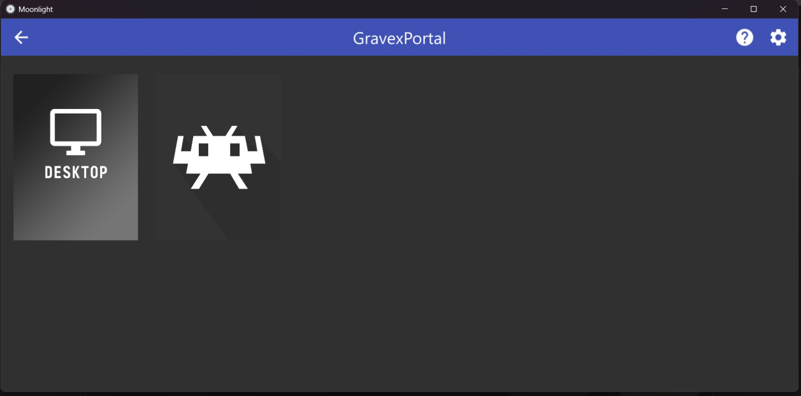

# Retro Game Server.
A final project for CSCI 4345

## Explanation of the Project
For this project, I created a remote retro gaming server using an old laptop I found at my house, so I installed Ubuntu on it. The goal was to configure a system that allowed another user to connect over the network and play games through game streaming technology. The system required setting up an operating system, installing emulation software, configuring a game streaming server, resolving network issues, and successfully establishing a peer-to-peer remote gaming session.

The final result was a working RetroArch + Sunshine streaming setup where a remote client connected from another country ( Mexico) to my server, which is in the U.S, using taiscale and through Moonlight, and the client was able to play games hosted on my machine.

## Implementation

### Network Topology
-	Server: Old laptop running Ubuntu (fresh installation).
-	VPN Mesh Network: Tailscale is used to bypass public IP and port forwarding limitations.
-	Client: Friend's computer running Moonlight.

  This setup created a virtual private network between the two devices, allowing direct encrypted communication using Tailscale assigned IPs.

## Configuration Details

1. Ubuntu Installation
    - I had an old laptop that nobody used anymore because it was slow. It was running Windows 10, and I saw the opportunity to give it a second life and use it for this project.
      The first step was to create a bootable USB drive. I used a program called "Rufus" to do this.
      The second step was to save the Windows key, just in case I needed it later. After this, I restarted the computer to access the BIOS and boot menu.
      After setting everything correctly, I restarted it again to go to the boot menu. From there, I used the USB drive as a boot device to run Ubuntu.
      Once in the Ubuntu trial desktop, I started the installation and deleted Windows.
    
3. RetroArch Setup
	  - Now that Ubuntu was running, I started installing the software I would need.
    Using Ubuntu's terminal, I installed RetroArch (I later found out that Ubuntu has a “playstore” where you can also download software). After some time and complications,
   	I was able to get RetroArch running on my machine. I adjusted the settings to make the interface more user-friendly.
    For the BIOS and ROMs, I used my own collection of games. After setting everything up, I made several test runs.
    There were some complications at the beginning, such as latency issues with certain games, but I was able to solve them, and the games now run smoothly.

3. Sunshine Setup
      - Same process for the installation of sunshine, using the terminal to download and install this software.
    After installation, I was able to access the Sunshine home page, where I created a user. Once that was done, I was able to change the settings,
   	to get it ready for the next steps.
      - Important to say during this step, my friend installed Moonlight on his computer.

4. Network Configuration Issues
	  - I ran into some connection issues while testing with my friend's computer, he couldn’t access it using my public IP.
      After searching forums like Reddit, I found out the issue was my router. Spectrum router does not allow modifying certain network settings, including port forwarding,
      So I needed to find a solution to this problem.
      
5. Tailscale VPN
  -	Installed Tailscale on both server and client.
  -	Created a Tailscale mesh network.
  -	Used the Tailscale assigned private IP as the Moonlight connection address.
  -	Verified that the peer showed up correctly in the Tailscale admin console.

## Communication Flow

1.	Sunshine hosts a game streaming server on the Ubuntu laptop.
2.	Tailscale creates a direct VPN tunnel between the laptop and the client.
3.	Moonlight connects to Sunshine using the Tailscale private IP.
4.	Game-stream video/audio streams from Sunshine → Moonlight.
5.	Controller input sends back from Moonlight → Sunshine.
6.	Remote user plays RetroArch games in real time.

## Tools and Technologies
-	Ubuntu Linux (OS)
-	RetroArch (Emulator)
-	Sunshine (Game streaming server)
-	Moonlight (Client application)
-	Tailscale (VPN mesh networking)
-	Spectrum Router (with limitations that required VPN workaround)

## Demonstration
### The demonstration included:
-	Screenshots of Ubuntu installed.
  

-	Installing RetroArch
  

-	RetroArch Installed
  

-	Sunshine Installation
  
 
-	Sunshine is installed and running
  

- Sunshine up  
  
 
- Sunshine Network Settings
  

-	Tailscale Installation
  

-	Showing assigned IP.
	
 
-	Friend showing connection to mesh
  

-	Friend showing he is unable to connect to Server
  
 	
-	Friend Showing is accessible now
  
 
-	Video recording of the remote gaming session.

https://github.com/user-attachments/assets/27e876dd-9243-48fc-9b92-5058fa29cd37

https://github.com/user-attachments/assets/3089d364-3456-43e8-8d2d-e9a286c2441b

https://github.com/user-attachments/assets/da34c6fa-2c1f-4569-8710-8386868df1fe

The remote gameplay session was successful, my friend was able to connect using Moonlight and play a game streamed from my Ubuntu laptop.

## Citations

### Software used

- RetroArch. (n.d.). RetroArch. https://www.retroarch.com

- LizardByte. (n.d.). Sunshine. https://app.lizardbyte.dev

- Moonlight. (n.d.). Moonlight. https://moonlight-stream.org

- Tailscale. (n.d.). Tailscale. https://tailscale.com

- Ubuntu. (n.d.). Ubuntu. https://ubuntu.com/download

### Documentation Used

- RetroArch. (n.d.). RetroArch documentation. https://docs.libretro.com/guides/install-windows/

- LizardByte. (n.d.). Sunshine server wiki. https://docs.lizardbyte.dev/projects/sunshine/latest/

- Tailscale. (n.d.). Tailscale setup guide. https://tailscale.com/kb

### YouTube Tutorials

- Ubuntu installation walkthroughs. (n.d.). Ubuntu installation walkthrough [Video]. YouTube. https://youtu.be/hNYH7xkdYYQ

- RetroArch installation & configuration. (n.d.). RetroArch installation & configuration [Video]. YouTube. https://www.youtube.com/watch?v=8QLpkRgeR-I

- RetroArch installation & configuration. (n.d.). RetroArch installation & configuration [Video]. YouTube. https://www.youtube.com/watch?v=4BOPUXgGw_o

- Sunshine + Moonlight setup tutorials. (n.d.). Sunshine + Moonlight setup tutorial [Video]. YouTube. https://www.youtube.com/watch?v=P4jt4wSAX7s
